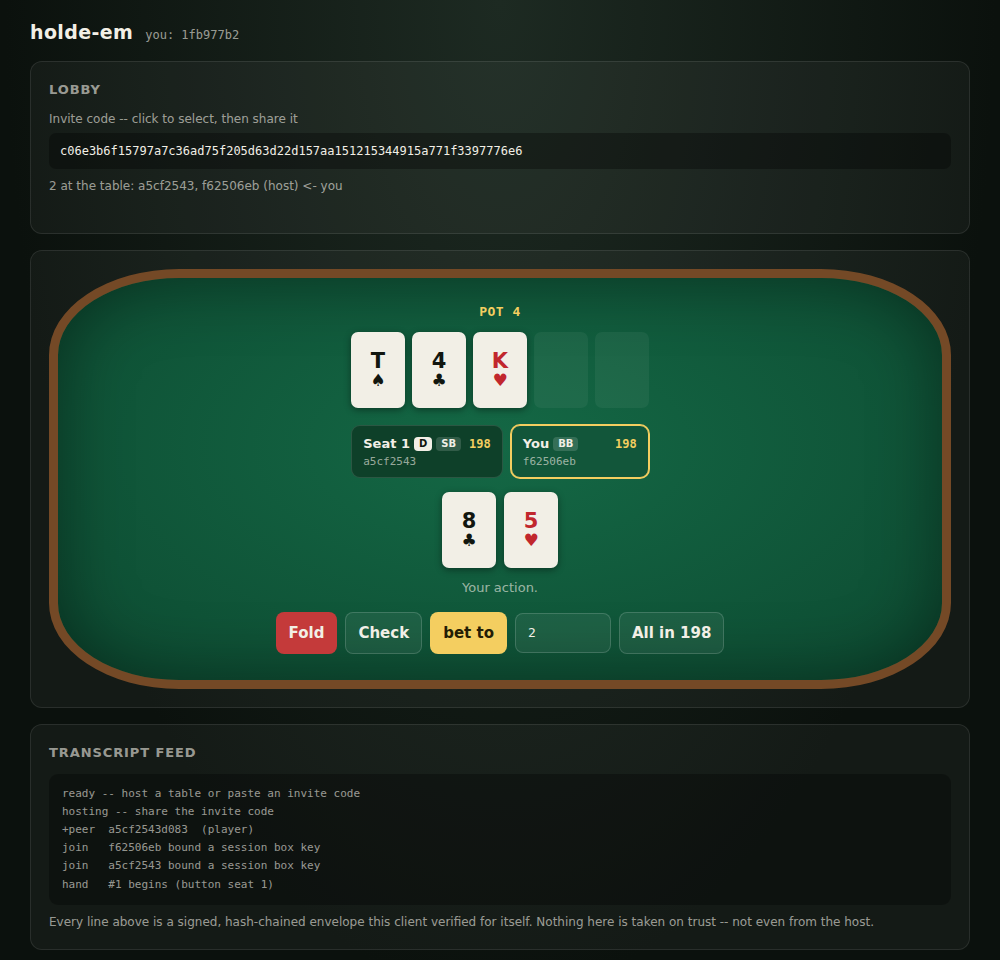

# holde-em on the web

A browser client for the protocol in [`../HOLDEM-PROTOCOL.md`](../HOLDEM-PROTOCOL.md) --
identity, hosting, joining, and full no-limit hold'em with the real signed transcript,
the committed Level 0 deal, sealed hole cards, side pots, and co-signed settlement
receipts.



**Status: playable browser-to-browser, verified end to end. It cannot yet join a table
hosted by the OXT stack** -- that is a transport limitation, not a protocol one. Read
section 4 before planning around it.

```
web/
  holdem-protocol.mjs      the protocol core: primitives, envelope, chain, Level 0 deal,
                           settlement/receipt hashing, admission tokens, cards
  engine.mjs               the pure rules: evaluator, betting state machine, side pots
  client.mjs               the protocol loop: ingest/ordering, authority, react ladder,
                           dealer duties, host relay
  transport.mjs            transport adapters (loopback for tests, WebSocket for play)
  relay.mjs                a dumb WebSocket fan-out relay + static server
  index.html               the UI
  conformance.mjs          protocol core vs tools/protocol-kat.py
  engine-conformance.mjs   engine vs the reference mirror, differentially
  gen-engine-trace.py      drives the reference mirror to produce those traces
  table-sim.mjs            headless N-client end-to-end simulation
```

## 1. Play

```sh
cd web && npm install
node relay.mjs                 # http://localhost:8787/
```

Open the page twice (two browsers, or one plus a private window -- each needs its own
identity). Host in one, copy the invite code, join in the other, press **Start game**.

## 2. Run the tests

```sh
npm test                       # protocol core vs the pinned KAT vectors
npm run test:engine            # engine vs the reference mirror, ~600 hands
npm run sim                    # 3 clients, 3 hands, end to end
npm run sim:lossy              # same, over a transport that drops/dups/reorders
```

## 3. What is actually verified

Nothing below is asserted from reading the code; each item is a test that fails if the
claim stops being true.

**Protocol core (`conformance.mjs`, 43 assertions).** Checked against **the same pinned
vectors the xTalk reference is held to**, read live from `tools/protocol-kat.py --json`
so they cannot drift. Covers the full Level 0 deal (commitments, seed XOR, stream key,
the 52-card deck, holes, board, burns, all five deal-order signatures), the byte-exact
`env0_wire`, a six-envelope chain, both settle hashes, the two-hand receipt chain,
ckpt/admit signatures, the canonical roster body, the lobby chain head, sealed-lane
roundtrips, and every hostile-input class in protocol doc 15.2 item 4 -- each of which
must produce the **exact documented drop reason** and must not throw.

**Engine (`engine-conformance.mjs`, ~9000 checks over 600 hands).** `tools/betting-kat.py`
is a line-for-line Python mirror of the xTalk betting engine, and `tools/logic-fuzz.py`
already checks *that* mirror against an independently written reference -- so pinning the
JS port to it transitively pins it to the rules the engine and the fuzz agree on.
`gen-engine-trace.py` drives the mirror over randomized hands (sparse seats, uneven
stacks, antes, all-ins) recording every intermediate state; the JS replays the identical
message sequence and must match **at every step**, so a divergence is caught at the
message that caused it. It also checks chip conservation, showdown order, the KAT
evaluator vectors, and that everything `betLegal` offers, `apply` accepts.

That harness was **mutation-tested**: deleting the under-raise reopen rule, the
heads-up button-is-SB rule, the wheel straight, odd-chip distribution, dead-money ante
handling, or adding one chip to a split pot -- all six are caught.

**End to end (`table-sim.mjs`).** N independent clients over a loopback bus play real
hands with nothing stubbed. Every client verifies every signature and folds the chain
itself. Asserted per hand, on every client: identical chain head, identical applied seq,
identical stacks, chip conservation, an agreeing receipt chain co-signed by every seat,
an audit verdict of `pass` from every seat, and that every seat opened its own sealed
hole cards. Plus: a late joiner converging from the transcript alone, a lying host
settle moving no chips and being flagged, an out-of-turn act changing nothing, and a
tampered wire being refused. Passes at 2/3/4/6 players, and **under 6% packet loss with
10% duplication and reordering**.

**In real browsers.** Two Chromium instances against the relay play a hand to
settlement: both open their sealed hole cards, hold *different* cards, agree on the
settle line independently, record an audit `pass`, co-sign the receipt, and neither
flags a dispute -- with zero console errors. (That harness needs Playwright and is not
committed; the Node tests are the CI gates.)

## 4. The transport limitation (read this before planning)

**A browser cannot join a table hosted by the OXT stack today.** The reference host
speaks rp1 -- a BEP10 BitTorrent peer-wire extension -- and finds peers over the
BitTorrent DHT. A browser has no raw TCP or UDP and cannot participate in either.

**WebTorrent does not close this gap**, though it is the natural thing to reach for:

- No browser exposes WebTorrent to a page. Brave bundles a WebTorrent-based viewer for
  magnet links, but that is a UI feature, not a JS API -- every WebTorrent web app ships
  the library itself.
- Browser WebTorrent peers connect over **WebRTC data channels only**. Classic
  BitTorrent peers -- libtorrent, and therefore TorrentXT -- use **TCP/uTP**. They form
  disjoint swarms: a browser peer cannot open a connection to a libtorrent peer no
  matter how much they agree about the infohash.
- TorrentXT pins **libtorrent v2.0.11**, which has no WebRTC transport.

rp1 itself would port fine -- it is "opaque bytes under a BEP10 extension name", and
WebTorrent supports BEP10 extensions -- so an rp1-compatible browser swarm is writable.
It would just only ever reach other browsers.

**The thing that does close the gap is already planned in TorrentXT**:
`docs/NEXT-EXTENSIONS-PLAN.md` Part IV specifies a **libdatachannel + libjuice**
extension (C ABI `dcx_`, public `dc*`, `org.openxtalk.library.datachannel`) explicitly
for "browser-interoperable P2P + real NAT traversal", data channels first -- and notes
that **signaling can ride TorrentXT's own DHT via BEP44**, keeping rendezvous
serverless. Once that ships, both sides speak WebRTC data channels and a browser can sit
at an OXT table with no bridge and no relay. It is listed as planned, third of three.

So the options, in order of cost:

| | What | Interop | Cost |
|---|---|---|---|
| **A** | Web-only tables via the relay here | browser <-> browser | **done, this directory** |
| **B** | An rp1 <-> WebSocket bridge | full | needs rp1 outside OXT, or an OXT stack in bridge mode |
| **C** | DataChannelXT lands in TorrentXT | full, serverless | the planned extension; strictly better than a bridge |

The relay in A is deliberately dumb: it verifies nothing, knows nothing about poker,
cannot read a hole card, and cannot change who wins. Its entire power is to drop or
delay payloads -- which is exactly what the ingest rules survive. Swapping it for B or C
changes `transport.mjs` and nothing else.

## 5. Why libsodium.js and not WebCrypto

| Primitive | WebCrypto | Node `crypto` | libsodium.js |
|---|---|---|---|
| BLAKE2b-256 | no | **no** -- only `blake2b512` / `blake2s256` | yes |
| Ed25519 detached | recent browsers only | yes | yes |
| `crypto_box_seal` | no | no (no XSalsa20-Poly1305) | yes |

The BLAKE2b row is the trap protocol doc 2.1 calls out: BLAKE2b's digest length is part
of its parameter block, so **a truncated BLAKE2b-512 is a different function**, and a
port built on `blake2b512` produces a plausible chain nobody else agrees with.
`conformance.mjs` asserts `H("")` explicitly for exactly this reason. libsodium.js is
also the same library the xTalk binds through SodiumXT, so primitive drift is impossible.

## 6. Known gaps

- **Browser storage is not secure storage.** The identity seed sits in `localStorage`,
  exposed to XSS and to anyone with the device. The protocol assumes the long-term key
  never leaves the machine, which a browser honors only as well as its origin isolation
  does. Wrapping the seed with `crypto_pwhash` + `secretbox` behind a passphrase is the
  obvious hardening and should land before any table carries value.
- **No timers.** Protocol doc 12.1 provides for act timers and a time bank; this client
  waits indefinitely for the seat to act. Liveness (timeouts, sit-out, host election) is
  deferred in the reference implementation too.
- **Level 0 only.** The dealer sees every card that hand, exactly as specified -- which
  is why the deal rotates. Levels 1 and 2 are not implemented anywhere yet.
- **Retry pass, not a real liveness protocol.** `Table.retryPass()` re-emits anything the
  transcript still does not carry, which is what makes a dropped frame recoverable. It is
  safe because every emission is presence-guarded and the fold side is idempotent, but it
  is a robustness measure, not the spec 9 liveness design.
- **The reference implementation shares the underlying gap**: its emission flags are
  equally sticky, so a lost player-to-host frame would wedge a hand there too. It gets
  away with it because rp1 rides TCP peer connections. Worth folding back into the xTalk
  if that assumption ever weakens.
